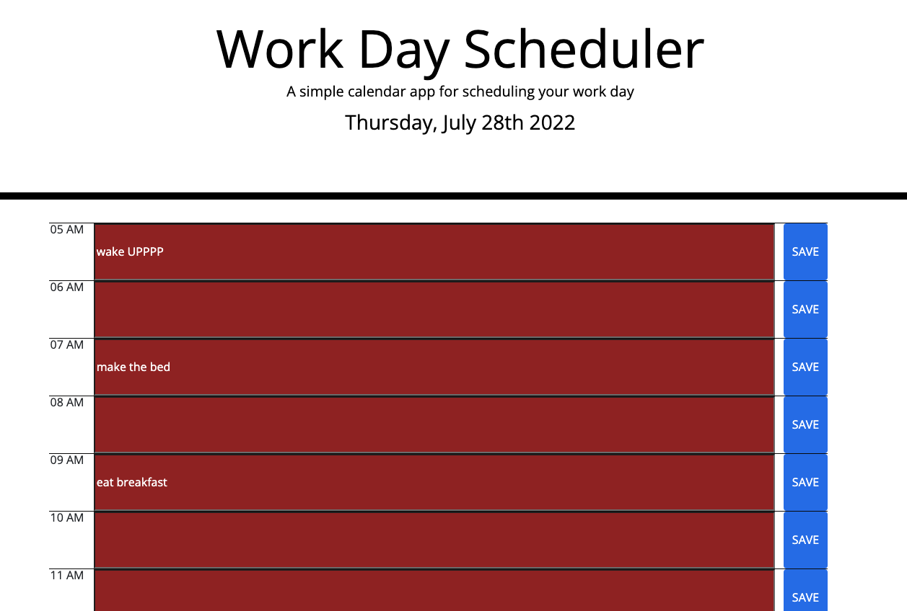

Module 5 Challenge: Work Day Scheduler

I created this project to work on utilizing Momentjs as well as working on utilizing jQuery in my code.  This scheduler saves what you input into the time block you select and saves it to local storage so that when you refresh, what you wrote is still there. This scheduler is also color coded so that anything in the past will appear in red, present will appear in grey and the future will appear in green.  

Things I learned from this project: 
  - I learned to slice my variables so that I was getting only the 5 of the 5 AM so that it would be easier logic to follow on my if statements
  - I learned how to use $("") to target a document within my HTML with jQuery and then use that to also store and get items from my local storage.  
  - I got more comfortable with selecting elements with .siblings
  - I worked for a while on my for loop so that I could make i = 5 (the time I was starting at) and then select children elements from boxColor as well as being sure I started in the correct row by doing back ticks `row-${i-4}`.  

Some challenges I'm still having are getting my local storage retrieval to be in a for loop so that I didn't have to write out my code for every item and each time zone. I'd like to work on the for loop in the future to make it so I don't have repeating code in my JS.  I also had challenges with the color change and using .toggle for the past, present and future color changes.  

website link: https://spencerjpross.github.io/work-day-scheduler/
github link: https://github.com/spencerjpross/work-day-scheduler